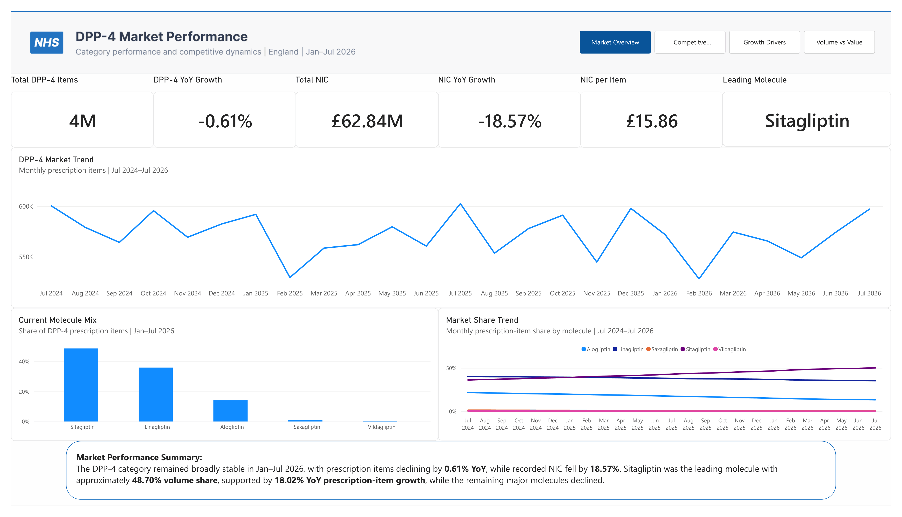
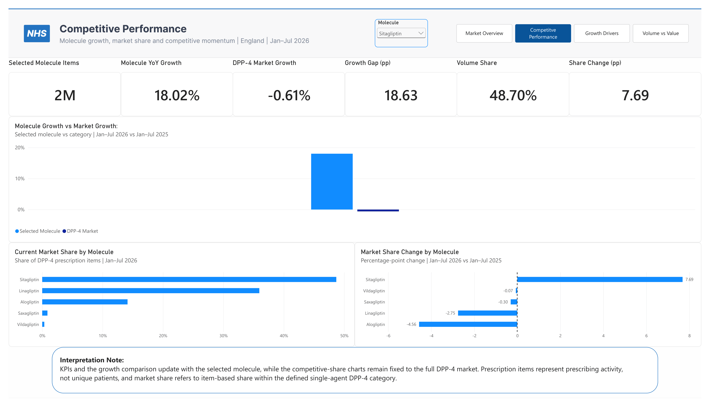
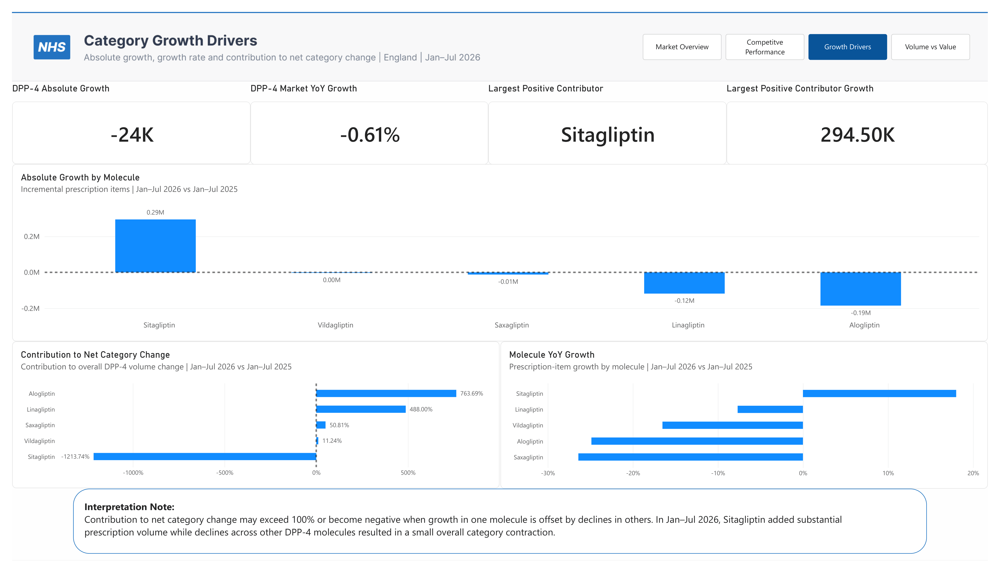
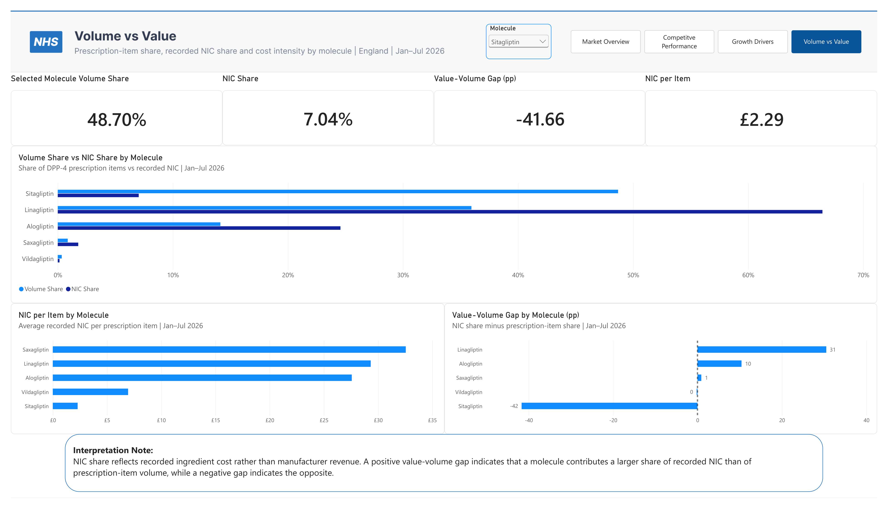

# DPP-4 Market Performance Tracker

A Power BI pharmaceutical commercial analytics project evaluating DPP-4 category performance across major molecules in England, with a focus on prescribing growth, competitive share, contribution to category change, recorded ingredient cost, and volume-versus-value dynamics.

The project uses publicly available NHS prescribing data to answer four core commercial questions:

1. How is the DPP-4 category performing overall?
2. Which molecules are gaining or losing competitive position?
3. Which molecules are driving net category growth or decline?
4. How does prescription-volume share differ from recorded NIC share?

---

## Project Overview

This project was designed as a focused market-performance tracker for the English DPP-4 prescribing category.

The analysis covers five major single-agent DPP-4 molecules:

- Sitagliptin
- Linagliptin
- Alogliptin
- Saxagliptin
- Vildagliptin

The project intentionally excludes combination products from the primary market definition to maintain a clear and auditable competitive denominator.

### Analytical Period

**Headline comparison**

> Jan–Jul 2026 vs Jan–Jul 2025

**Historical trend coverage**

> Jul 2024–Jul 2026

The historical period is used for monthly trend analysis, while the headline comparison uses equivalent seven-month periods.

---

# Business Question

> How has the English DPP-4 prescribing market evolved, and which molecules are driving changes in category volume, competitive share and recorded ingredient cost?

Supporting questions include:

- How large is the DPP-4 category?
- Is the category growing or declining?
- Which molecules hold the largest prescribing-volume share?
- Which molecules are growing fastest?
- Which molecules are gaining or losing share?
- Which molecules contribute most to net category change?
- How does NIC share differ from prescription-item share?
- How does NIC per item vary across molecules?

---

# Dashboard

The Power BI report contains four analytical pages.

---

## Page 1 — Market Overview



The first page provides an executive view of the overall DPP-4 category.

### Headline KPIs

- **Total DPP-4 Items:** approximately 4.0M
- **DPP-4 YoY Growth:** -0.61%
- **Total NIC:** £62.84M
- **NIC YoY Growth:** -18.57%
- **NIC per Item:** £15.86
- **Leading Molecule:** Sitagliptin

### Key Visuals

- DPP-4 Market Trend
- Current Molecule Mix
- Market Share Trend
- Market Performance Summary

### Key Insight

The DPP-4 category remained broadly stable in Jan–Jul 2026, with prescription items declining by **0.61% YoY**.

Despite limited movement in total category volume, the competitive mix shifted materially.

Sitagliptin became the leading molecule with approximately **48.70% volume share**, supported by **18.02% YoY prescription-item growth**, while the remaining major molecules declined.

Recorded NIC declined significantly faster than volume, falling by **18.57% YoY**.

---

## Page 2 — Competitive Performance



The second page evaluates competitive performance by molecule.

A molecule selector allows users to dynamically compare each molecule against the overall DPP-4 category.

### Selected-Molecule KPIs

- Selected Molecule Items
- Molecule YoY Growth
- DPP-4 Market Growth
- Growth Gap
- Volume Share
- Share Change

### Key Visuals

- Molecule Growth vs DPP-4 Market Growth
- Current Market Share by Molecule
- Market Share Change by Molecule

### Sitagliptin Example

For Jan–Jul 2026:

- **Prescription-item growth:** +18.02%
- **DPP-4 category growth:** -0.61%
- **Growth Gap:** +18.63 percentage points
- **Volume Share:** 48.70%
- **Share Change:** +7.69 percentage points

This indicates that Sitagliptin substantially outperformed the wider DPP-4 category and strengthened its competitive position.

### Interpretation Note

KPIs and the growth comparison update with the selected molecule, while the competitive-share charts remain fixed to the full DPP-4 market.

Prescription items represent prescribing activity rather than unique patients, and market share refers to item-based share within the defined single-agent DPP-4 category.

---

## Page 3 — Category Growth Drivers



The third page examines which molecules are driving net category change.

### Headline KPIs

- **DPP-4 Absolute Growth:** approximately -24K prescription items
- **DPP-4 Market YoY Growth:** -0.61%
- **Largest Positive Contributor:** Sitagliptin
- **Sitagliptin Absolute Growth:** approximately +295K prescription items

### Key Visuals

- Absolute Growth by Molecule
- Contribution to Net Category Change
- Molecule YoY Growth

### Key Insight

Although the overall DPP-4 market contracted slightly, Sitagliptin added substantial prescription volume.

The positive growth generated by Sitagliptin was offset by declines across:

- Linagliptin
- Alogliptin
- Saxagliptin
- Vildagliptin

This demonstrates the distinction between:

- **absolute growth** — how much volume changed;
- **percentage growth** — how fast the molecule changed; and
- **contribution to net category change** — how each molecule shaped the total market outcome.

### Interpretation Note

Contribution to net category change may exceed 100% or become negative when growth in one molecule is offset by declines in others.

In Jan–Jul 2026, Sitagliptin added substantial prescription volume while declines across other DPP-4 molecules resulted in a small overall category contraction.

---

## Page 4 — Volume vs Value



The fourth page evaluates whether competitive importance changes when recorded ingredient cost is considered alongside prescription-item volume.

### Selected-Molecule KPIs

- Prescription-Item Share
- Recorded NIC Share
- Value-Volume Gap
- Recorded NIC per Item

### Key Visuals

- Volume Share vs NIC Share by Molecule
- NIC per Item by Molecule
- Value-Volume Gap by Molecule

### Sitagliptin Example

For Jan–Jul 2026:

- **Volume Share:** 48.70%
- **NIC Share:** 7.04%
- **Value-Volume Gap:** -41.66 percentage points
- **NIC per Item:** approximately £2.29

In contrast, Linagliptin represented a substantially larger proportion of recorded NIC than of prescription-item volume.

### Key Insight

The largest molecule by prescription volume is not necessarily the largest molecule by recorded ingredient cost.

Differences between volume share and NIC share are associated with differences in average recorded NIC per item and prescribing mix.

### Interpretation Note

NIC share reflects recorded ingredient cost rather than manufacturer revenue.

A positive value-volume gap indicates that a molecule contributes a larger share of recorded NIC than of prescription-item volume, while a negative gap indicates the opposite.

---

# Market Definition

The primary analytical market consists of five single-agent DPP-4 molecules:

- Sitagliptin
- Linagliptin
- Alogliptin
- Saxagliptin
- Vildagliptin

Combination products were excluded from the primary analysis.

This ensures that market share, growth and contribution calculations use a consistent denominator.

Therefore:

> Market share in this project refers to prescription-item share within the defined single-agent DPP-4 category.

---

# Data Source

The project uses publicly available data from the:

**NHS Business Services Authority — English Prescribing Dataset**

Relevant source fields include:

- Prescribing month
- Chemical substance
- Chemical description
- BNF presentation code
- Presentation name
- Prescription items
- Total quantity
- Net Ingredient Cost
- Actual Cost
- SNOMED code

The dataset records prescribing activity in England and is updated monthly.

---

# Data Preparation

The preparation workflow was completed in Power Query.

The main steps included:

1. Importing monthly prescribing files.
2. Harmonising multiple source schemas.
3. Standardising field names.
4. Correcting date formats.
5. Correcting numeric types for financial measures.
6. Filtering to the five defined DPP-4 molecules.
7. Excluding combination products.
8. Appending monthly files.
9. Aggregating practice-level records to monthly presentation level.
10. Creating dimension tables.
11. Validating monthly coverage and commercial measures.

---

## Analytical Grain

The source data is originally available at GP-practice level.

Because this project does not include geography, records were aggregated to:

> one row per presentation per month

The grouping structure includes:

- YearMonth
- ChemicalCode
- Molecule
- PresentationCode
- PresentationName
- SNOMEDCode

The following measures were aggregated using sums:

- Items
- TotalQuantity
- NIC
- ActualCost

---

## Financial Data-Type Quality Assurance

An important transformation requirement was ensuring that `NIC` and `Actual Cost` were imported as decimal numeric values.

These fields were parsed using appropriate locale handling before append and aggregation.

This prevented loss of decimal precision and ensured that recorded cost measures remained analytically valid.

---

# Data Model

The Power BI model follows a simple star-schema structure.

```text
                    Dim_Calendar
                         |
                         |
Dim_Chemical ---- Fact_Prescribing ---- Dim_Presentation
```

---

## Fact Table

### `Fact_Prescribing`

Contains:

- YearMonth
- ChemicalCode
- Molecule
- PresentationCode
- PresentationName
- Items
- TotalQuantity
- NIC
- ActualCost
- SNOMEDCode

---

## Dimension Tables

### `Dim_Calendar`

Contains:

- YearMonth
- Year
- MonthNumber
- MonthName
- Quarter
- MonthYear
- YearMonthSort

---

### `Dim_Chemical`

Contains:

- ChemicalCode
- Molecule
- TherapyClass
- DPP4Flag

---

### `Dim_Presentation`

Contains:

- PresentationCode
- PresentationName
- ChemicalCode
- Molecule
- SNOMEDCode
- Formulation
- Strength
- PresentationGroup

---

# Core Commercial Measures

## Total Items

```DAX
Total Items =
SUM(Fact_Prescribing[Items])
```

---

## NIC

```DAX
NIC =
SUM(Fact_Prescribing[NIC])
```

---

## Actual Cost

```DAX
Actual Cost =
SUM(Fact_Prescribing[ActualCost])
```

---

## NIC per Item

```DAX
NIC per Item =
DIVIDE(
    [NIC],
    [Total Items]
)
```

---

# Previous-Year Measures

```DAX
PY Total Items =
CALCULATE(
    [Total Items],
    SAMEPERIODLASTYEAR(Dim_Calendar[YearMonth])
)
```

```DAX
PY NIC =
CALCULATE(
    [NIC],
    SAMEPERIODLASTYEAR(Dim_Calendar[YearMonth])
)
```

```DAX
PY NIC per Item =
CALCULATE(
    [NIC per Item],
    SAMEPERIODLASTYEAR(Dim_Calendar[YearMonth])
)
```

---

# Growth Measures

## Absolute Items Growth

```DAX
Absolute Items Growth =
VAR PreviousItems =
    [PY Total Items]
RETURN
IF(
    NOT ISBLANK(PreviousItems),
    [Total Items] - PreviousItems
)
```

---

## Items YoY Growth

```DAX
Items YoY Growth =
VAR PreviousItems =
    [PY Total Items]
RETURN
IF(
    NOT ISBLANK(PreviousItems),
    DIVIDE(
        [Total Items] - PreviousItems,
        PreviousItems
    )
)
```

---

## NIC YoY Growth

```DAX
NIC YoY Growth =
VAR PreviousNIC =
    [PY NIC]
RETURN
IF(
    NOT ISBLANK(PreviousNIC),
    DIVIDE(
        [NIC] - PreviousNIC,
        PreviousNIC
    )
)
```

---

# DPP-4 Market Measures

## DPP-4 Market Items

```DAX
DPP4 Market Items =
CALCULATE(
    [Total Items],
    REMOVEFILTERS(Dim_Chemical)
)
```

---

## Prior-Year DPP-4 Market Items

```DAX
PY DPP4 Market Items =
CALCULATE(
    [DPP4 Market Items],
    SAMEPERIODLASTYEAR(Dim_Calendar[YearMonth])
)
```

---

## DPP-4 Market YoY Growth

```DAX
DPP4 Market YoY Growth =
VAR PreviousMarket =
    [PY DPP4 Market Items]
RETURN
IF(
    NOT ISBLANK(PreviousMarket),
    DIVIDE(
        [DPP4 Market Items] - PreviousMarket,
        PreviousMarket
    )
)
```

---

# Market Share Measures

## Volume Share

```DAX
Volume Share =
DIVIDE(
    [Total Items],
    [DPP4 Market Items]
)
```

---

## Prior-Year Volume Share

```DAX
PY Volume Share =
CALCULATE(
    [Volume Share],
    SAMEPERIODLASTYEAR(Dim_Calendar[YearMonth])
)
```

---

## Volume Share Change

```DAX
Volume Share Change (pp) =
VAR PreviousShare =
    [PY Volume Share]
RETURN
IF(
    NOT ISBLANK(PreviousShare),
    ([Volume Share] - PreviousShare) * 100
)
```

---

# Growth Gap

```DAX
Growth Gap (pp) =
VAR MoleculeGrowth =
    [Items YoY Growth]
VAR MarketGrowth =
    [DPP4 Market YoY Growth]
RETURN
IF(
    NOT ISBLANK(MoleculeGrowth)
        && NOT ISBLANK(MarketGrowth),
    (MoleculeGrowth - MarketGrowth) * 100
)
```

The Growth Gap measures whether a molecule is growing faster or slower than the overall category.

---

# Contribution to Net Category Change

## DPP-4 Absolute Growth

```DAX
DPP4 Absolute Growth =
VAR PreviousMarket =
    [PY DPP4 Market Items]
RETURN
IF(
    NOT ISBLANK(PreviousMarket),
    [DPP4 Market Items] - PreviousMarket
)
```

---

## Contribution to Net Category Change

```DAX
Contribution to Net Category Change =
VAR MoleculeGrowth =
    [Absolute Items Growth]
VAR MarketGrowth =
    [DPP4 Absolute Growth]
RETURN
IF(
    NOT ISBLANK(MoleculeGrowth)
        && NOT ISBLANK(MarketGrowth),
    DIVIDE(
        MoleculeGrowth,
        MarketGrowth
    )
)
```

Contribution percentages may exceed 100% or become negative when positive and negative molecule-level changes offset each other.

---

# Recorded NIC Measures

## DPP-4 Market NIC

```DAX
DPP4 Market NIC =
CALCULATE(
    [NIC],
    REMOVEFILTERS(Dim_Chemical)
)
```

---

## NIC Share

```DAX
NIC Share =
DIVIDE(
    [NIC],
    [DPP4 Market NIC]
)
```

---

## Value-Volume Gap

```DAX
Value-Volume Gap (pp) =
([NIC Share] - [Volume Share]) * 100
```

The value-volume gap measures the difference between a molecule's recorded NIC share and prescription-item share.

A positive gap indicates:

> NIC share > volume share

A negative gap indicates:

> NIC share < volume share

This is a recorded-cost relationship and should not be interpreted as profitability.

---

# Leading Molecule

```DAX
Leading Molecule =
VAR T =
    TOPN(
        1,
        ADDCOLUMNS(
            VALUES(Dim_Chemical[Molecule]),
            "ItemsValue",
            [Total Items]
        ),
        [ItemsValue],
        DESC,
        Dim_Chemical[Molecule],
        ASC
    )
RETURN
MAXX(
    T,
    Dim_Chemical[Molecule]
)
```

---

# Largest Positive Contributor

```DAX
Largest Positive Contributor =
VAR T =
    FILTER(
        ADDCOLUMNS(
            VALUES(Dim_Chemical[Molecule]),
            "AbsoluteGrowth",
            [Absolute Items Growth]
        ),
        [AbsoluteGrowth] > 0
    )

VAR TopMolecule =
    TOPN(
        1,
        T,
        [AbsoluteGrowth],
        DESC,
        Dim_Chemical[Molecule],
        ASC
    )

RETURN
MAXX(
    TopMolecule,
    Dim_Chemical[Molecule]
)
```

---

# Commercial Interpretation

## Absolute Growth vs Percentage Growth

Absolute growth answers:

> How much prescribing volume was added or lost?

Percentage growth answers:

> How fast did the molecule grow or decline?

These measures should not be interpreted interchangeably.

A smaller molecule may grow rapidly in percentage terms but contribute relatively little incremental volume.

---

## Market Share vs Share Change

Market share describes current category size.

Share change describes movement in competitive position.

A molecule can:

- grow and gain share;
- grow and lose share;
- decline and gain share; or
- decline and lose share,

depending on how its performance compares with the overall category.

---

## Volume Share vs NIC Share

Prescription-item share reflects prescribing activity.

NIC share reflects recorded ingredient cost.

A molecule can hold a large volume share but a smaller NIC share if its recorded NIC per item is lower than competitors.

The opposite can also occur.

---

# Key Findings

The Jan–Jul 2026 analysis identified several important patterns.

### The DPP-4 Market Was Broadly Stable

Total DPP-4 prescription items declined by approximately:

> **0.61% YoY**

This indicates that the total category changed relatively little in net volume.

---

### Sitagliptin Strengthened Its Competitive Position

Sitagliptin prescription items increased by:

> **18.02% YoY**

while the overall DPP-4 market declined by:

> **0.61%**

This produced a Growth Gap of approximately:

> **+18.63 percentage points**

Sitagliptin's volume share increased to approximately:

> **48.70%**

representing a gain of:

> **+7.69 percentage points**

---

### Category Stability Masked Large Internal Changes

Although the total market declined only slightly, molecule-level movements were substantial.

Sitagliptin added approximately:

> **295K prescription items**

while declines across other molecules offset this growth.

This demonstrates why net category growth alone does not explain the competitive dynamics occurring within the market.

---

### Recorded NIC Declined Faster Than Volume

The category's recorded NIC declined by approximately:

> **18.57% YoY**

while prescription items declined by only:

> **0.61%**

This suggests a substantial change in recorded NIC intensity relative to prescribing activity.

---

### Volume and NIC Shares Differ Materially

Sitagliptin represented approximately:

> **48.70% of DPP-4 prescription items**

but only approximately:

> **7.04% of recorded NIC**

producing a value-volume gap of approximately:

> **-41.66 percentage points**

Linagliptin showed the opposite pattern, representing a significantly larger proportion of recorded NIC than of prescription-item volume.

---

# Limitations

## Prescription Items Are Not Patients

Prescription items represent prescribing activity.

They should not be interpreted as unique patient counts.

---

## NIC Is Not Manufacturer Revenue

Net Ingredient Cost is a recorded prescribing-cost measure.

It should not be interpreted as:

- manufacturer revenue;
- sales;
- profit;
- margin; or
- realised selling price.

---

## NIC per Item Is Not Commercial Price

NIC per Item is used as an analytical diagnostic.

It should not be interpreted as the manufacturer's average selling price.

---

## Market Share Is Item-Based

Market share in this project is based on prescription items.

Different molecules may have different prescribing and dosing patterns.

Therefore:

> item-based market share is a prescribing-activity measure, not patient share or therapeutic-equivalent share.

---

## Combination Products Are Excluded

The primary market includes only the five defined single-agent DPP-4 molecules.

Combination products are excluded to maintain a consistent market definition.

---

## England Scope

The dataset represents prescribing activity captured within the English NHS prescribing dataset.

The findings should not be interpreted as total UK pharmaceutical consumption.

---

## No Causal Attribution

The project identifies commercial patterns and relationships.

It does not establish that changes in one metric caused changes in another.

---

# Dashboard Design

The dashboard was developed using a combined **Figma + Power BI** workflow.

## Figma

Figma was used for:

- dashboard header design;
- navigation shell;
- static background elements;
- visual consistency.

## Power BI

Power BI was used for:

- KPI cards;
- dynamic molecule selection;
- charts;
- DAX measures;
- time intelligence;
- page navigation;
- analytical summaries.

Navigation pages:

- **Market Overview**
- **Competitive Performance**
- **Growth Drivers**
- **Volume vs Value**

---

# Tools & Technologies

- Power BI
- Power Query
- DAX
- Figma
- NHSBSA English Prescribing Dataset
- GitHub

---

# Skills Demonstrated

This project demonstrates experience in:

- Pharmaceutical commercial analytics
- Category performance analysis
- Competitive market analysis
- Market share analysis
- Growth analysis
- Growth contribution analysis
- Recorded cost analysis
- Volume-versus-value analysis
- DAX
- Power Query
- Data modelling
- Time intelligence
- Data quality assurance
- Dashboard design
- Commercial interpretation
- Analytical storytelling

---

# Repository Structure

```text
DPP4-Market-Performance-Tracker/
│
├── README.md
│
├── images/
│   ├── market_overview.png
│   ├── competitive_performance.png
│   ├── growth_drivers.png
│   ├── volume_vs_value.png
│   └── data_model.png
│
├── data/
│   └── README.md
│
├── powerbi/
│   └── DPP4_Market_Performance_Tracker.pbix
│
└── docs/
    └── DPP4_Market_Performance_Tracker_Report.pdf
```

---

# Project Files

## Power BI Report

The full Power BI model, DAX measures, dashboard pages and navigation are contained in:

`powerbi/DPP4_Market_Performance_Tracker.pbix`

---

## Dashboard Images

Dashboard screenshots are stored in:

`images/`

Files:

- `market_overview.png`
- `competitive_performance.png`
- `growth_drivers.png`
- `volume_vs_value.png`
- `data_model.png`

---

## Data Documentation

Raw NHS prescribing files are not stored directly in the repository because of file size.

Data scope, preparation logic, analytical grain and quality-assurance considerations are documented in:

`data/README.md`

---

# Author

**Razaqa Muhammad Hanif Subagyo**

MSc Management of Information Systems & Digital Innovation  
Warwick Business School  
University of Warwick

Commercial Analytics | Business Analysis | Power BI | Digital Innovation

GitHub: [github.com/razaqasubagyo](https://github.com/razaqasubagyo)

---

# Related Projects

## Semaglutide Commercial Performance Tracker

Power BI commercial analytics project evaluating semaglutide prescription growth, GLP-1 market share, product mix and recorded cost dynamics.

[View Project](https://github.com/razaqasubagyo/Semaglutide-Commercial-Performance-Tracker)

---

## UK GLP-1 Commercial Opportunity & Disease Burden Analysis

Power BI analysis integrating NHS prescribing, GP population and diabetes-burden data to evaluate GLP-1 competitive performance and commercial opportunity.

[View Project](https://github.com/razaqasubagyo/UK-GLP1-Commercial-Opportunity-Disease-Burden-Analysis)

---

## UK Pharmaceutical Commercial Analytics — SGLT2 Market

Commercial analytics project examining SGLT2 prescribing performance, market share, molecule growth and geographic market development across England.

[View Project](https://github.com/razaqasubagyo/UK-Pharmaceutical-Commercial-Analytics-SGLT2-Market)

---

# Disclaimer

This project was developed independently for educational and portfolio purposes using publicly available NHS prescribing data.

It is not affiliated with, endorsed by, or produced on behalf of the NHS, any pharmaceutical manufacturer, or any other commercial organisation.

The analysis is intended to demonstrate pharmaceutical commercial analytics, Power BI, data modelling, DAX, data-quality assurance and dashboard-design capabilities.

It should not be interpreted as clinical, financial, commercial or investment advice.
